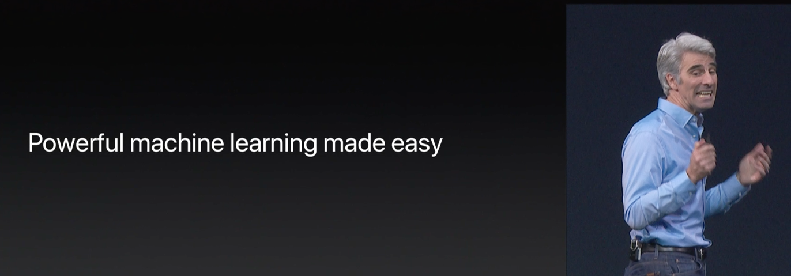
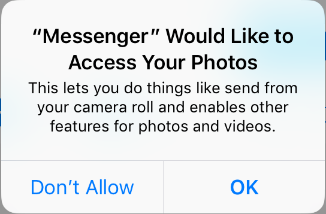
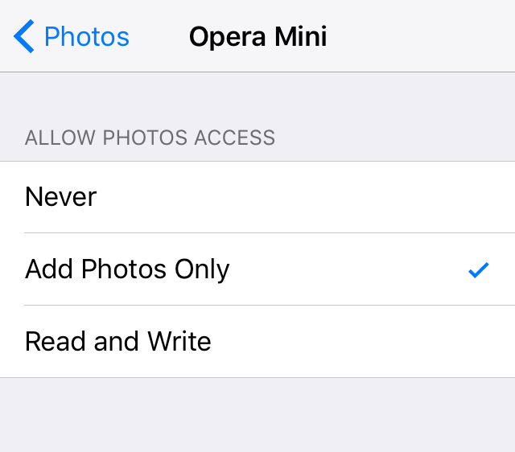
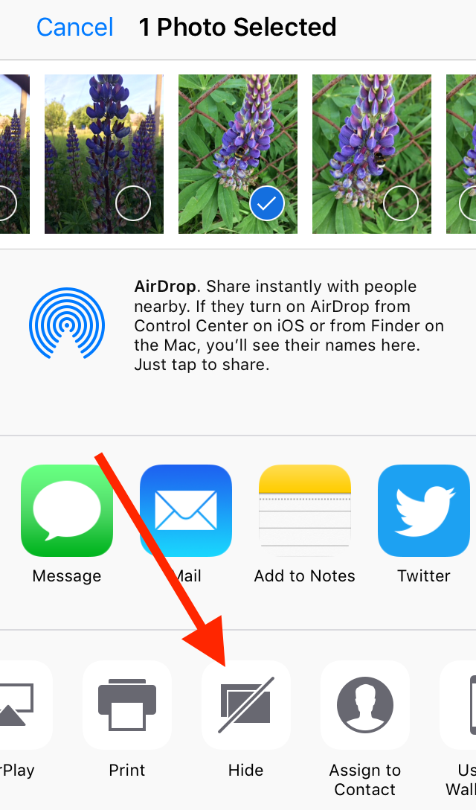
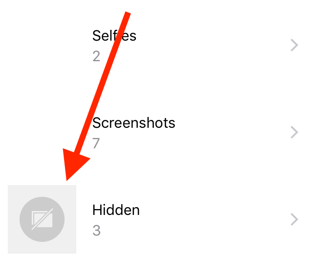
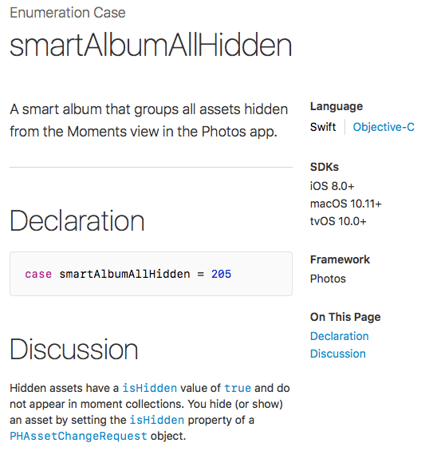
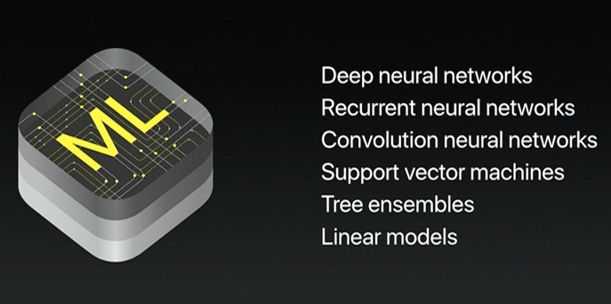
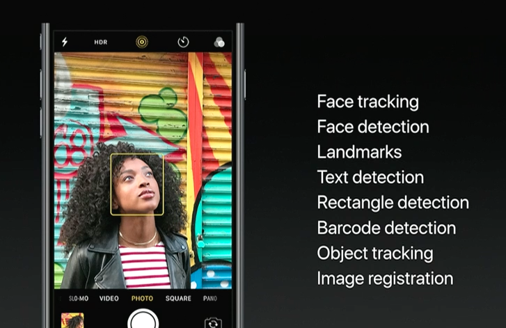
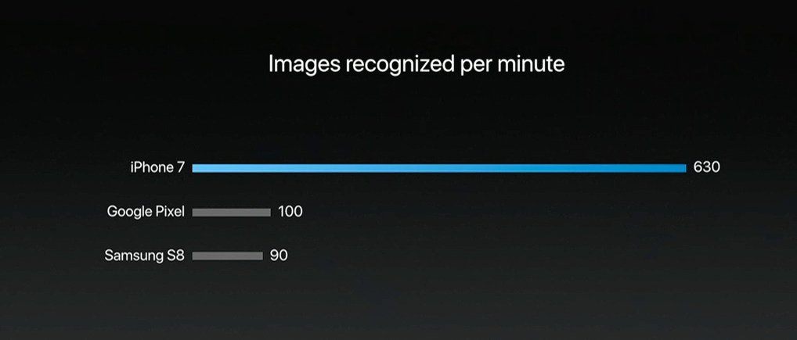

# CoreML Allows Stealing Your Private Info 6x Faster than Before

TL;DR: The problem that exists starting at least from iOS 8: any app, that you gave access to your photos and videos, can see ALL of them, including those in your "Hidden" album and iCloud. With the new iOS 11 machine learning features, it became super-easy for any application to steal sensitive information from the photos and videos. 

I've written a proff-of-concept iOS app that finds all your 'hidden' NSFW pictures. No private APIs were used, so the app will likely pass Apple review and will be released on the AppStore. Here is the [code on the Github](https://github.com/PrivacyNoName/iSpyML). I'm thinking about adding a Facebook integration now.

I did this, because I wanted to demonstrate, how easy it is to abuse user's security and privacy under current iOS permission management system.

## How Photo Permissions Work

No doubts you all have seen this type of messages:

Most of the users just always press "OK" without ever reading it. 
Some of you even know that you can reclaim those permissions back in iPhone settings:

By the way, this is a screenshot from iOS 11 beta, where they have added a new option: "Add photos only". By some reason, it is available only for some apps, and they just stop working if you opt it.

Now, what exactly can an app do with your photos? Anything: analyze in a background, compress, send to their servers and so on. You will never know because by pressing "OK" button you have agreed on all of those.

## "Hidden" Album

In iOS 8 Apple introduced a new awesome security and privacy feature: "Hidden album." So now you can safely store your photos in that album, right?

No, you can't. Any application that has access to your photo library also has access to this folder content. Even worse, by putting your sensitive photos into that album you are effectively marking them as *interesting*, so the malicious apps can say to the system: "Hey, give the whole folder of those interesting photos." And user will never know, that the app has just uploaded all his "hidden" photos to its servers. If you're an iOS developer, you can check it yourself. That's how what official documentation says about this feature:

## What's New in iOS 11

Ok, there was a major privacy and security hole for several years, but now in iOS 11, they have fixed this, right? Let's see, how that had changed in the iOS 11 beta.

First of all, now I can't reclaim permission I gave to Skype to see my photos because it's just is not on the list of the apps, which have those privileges. I checked in Skype itself, and it was able to see all my photos. Maybe it's just a bug in a beta version, but the alarming one: it signals that permission management system is poorly designed and is a full of bugs. Hidden album content is still visible in iOS 11 beta via Photos framework.

In iOS 11 Apple introduced a simple way to deploy neural networks and other machine learning models to your applications - CoreML framework. So now you don't need to upload user's photo to the cloud to do analysis there, you can do all analysis on device and users are paying electricity bills.

So, I put together a simple app that analyses the content of you 'hidden' album and rates all photos according to their 'NSFW'-ness. The porn detection is done using a deep neural network. The whole app development took like an hour or two. I used a [Yahoo NSFW neural network](https://github.com/yahoo/open_nsfw), converted it to CoreML and drag-and-dropped to the iOS project. A few lines of code and that's it. Read the [Yahoo blog post](https://yahooeng.tumblr.com/post/151148689421/open-sourcing-a-deep-learning-solution-for) if you're interested in how it works.

More to this, Apple provides separate APIs to get all your screenshots (what for I wonder?), all your selfies (including hidden NSFW selfies), APIs to analyze if the photo contains barcodes, QR codes, texts, faces and so on. Not speaking about GPS location which is saved in each photo's EXIF metadata if you haven't disabled it manually. It also provides an API to download photos from the iCloud if they are not on the device currently.

I'm not against machine learning (ML). It is great, and I used it in my apps even before the CoreML. But one should understand that it adds a lot of room for the privacy and security breaches. In fact, if you check the databases of scientific papers, you would see, there are a plenty of them about stealing some data from user's smartphone using ML:

- Stealing the PIN code
- Keylogging
- Voice recognition via the motion sensors
- Tricking the voice assistant with human-unintelligible commands
- Face and emotions recognition
- and so on and so forth

Any application that has permission to your photo library (namely: Skype, Twitter, Facebook, Snapchat, Prisma, etc.) can extract info not only about you but also about anyone, who had a mischance to be in your photos. 

## It's not about Porn

Researchers from Max Planck Institute for Informatics successfully used a neural network to extract the following personal information from the smartphone photo libraries:

**Personal Description**

- Gender
- Eye Color
- Hair Color
- Fingerprint
- Signature
- Face
- Tattoo
- Nudity
- Race
- (Skin) Color
- Traditional Clothing
- Full Name
- First Name
- Last Name
- Place of Birth
- Date of Birth
- Nationality
- Handwriting
- Marital status
- Religion
- Sexual Orientation
- Culture
- Hobbies
- Sports
- Personal Occasion
- General Opinion
- Political Opinion
- Personal Relationships
- Social Circle
- Professional Circle
- Competitors
- Spectators
- Similar view
- Education history
- Visited Landmark
- Visited Location
- Home address
- Date/Time of Activity
- Phone no.
- Username
- Email address
- Email content
- Online conversations
- Legal involvement
- Vehicle Ownership
- License Plate
- Employment
- Occupation
- Work Occasion

**Health**

- Physical disability
- Medical Treatment
- Medical History

**Documents**

- National Identification
- Credit Card
- Passport
- Drivers License
- Student ID
- Mail
- Receipts
- Tickets

Check this paper for more details:

> Orekondy, T., Schiele, B., Fritz, M. (2017). **Towards a Visual Privacy Advisor: Understanding and Predicting Privacy Risks in Images**. [arXiv](https://arxiv.org/abs/1703.10660)

Now, next time you are giving a viral selfie-editing app access to your photos, be aware, that you just had given access to all this plenty of private information.

With all these great features in iOS 11, I don't recommend anyone to install it until Apple introduces a way to control access to your data. Unfortunately, at the moment things look like Apple sees privacy as "just another feature," and that's why it always lags behind the stickers and emojis.

## One More Thing...

Finally, I want to cite several people at Apple:

> "Core ML provides high performance implementations of deep neural networks [...] and they allow you to take models [...], execute them with tremendous performance on device. **It gives you all the data privacy benefits** and all of the carefully tuned compatibility with all of our platforms, and the performance really is incredible. [...] **iPhone is six times faster** than Google Pixel and the Samsung S8 using Core ML". 

> \- *Craig Federighi – SVP, Software Engineering, Apple Inc., WWDC 2017.*

> "**Our team cares deeply about your privacy**". 

> \- *Phil Schiller – SVP, Worldwide Marketing at Apple, WWDC 2017*
> 
> "We believe you should have **great features and great privacy**. You demand it and we are dedicated to providing it".
> 
> \- *Craig Federighi – SVP, Software Engineering, Apple Inc., WWDC 2016.*

> "We’ve got PhotoKit, **gives you access to your complete iCloud Photo Library, all the videos, all the photos**".
> 
> \- *Eddy Cue – SVP, Internet Software and Services, WWDC 2016.*

> "But you know, all of this great work in iOS 10 would be meaningless to us if **it came at the expense of your privacy**. And so in every feature that we do, we carefully consider how to protect your privacy".
> 
> \- *Craig Federighi – SVP, Software Engineering, Apple Inc., WWDC 2016.*

> "But there was more we wanted to do. **Adding intelligence** throughout the user experience in a way that enhances how you use your device but without **compromising your privacy**". 
> 
> \- *Craig Federighi – SVP, Software Engineering, Apple Inc., WWDC 2015.*

---

# Questions and answers

**Q:** But still iOS has better security, than Android does!

**A:** The difference is like shooting a gun at your head (Android) vs. putting on a condom and then shooting a gun at your head (iOS).

**Q:** Have you filed a radar?

**A:** It's not a bug, it's a feature.
